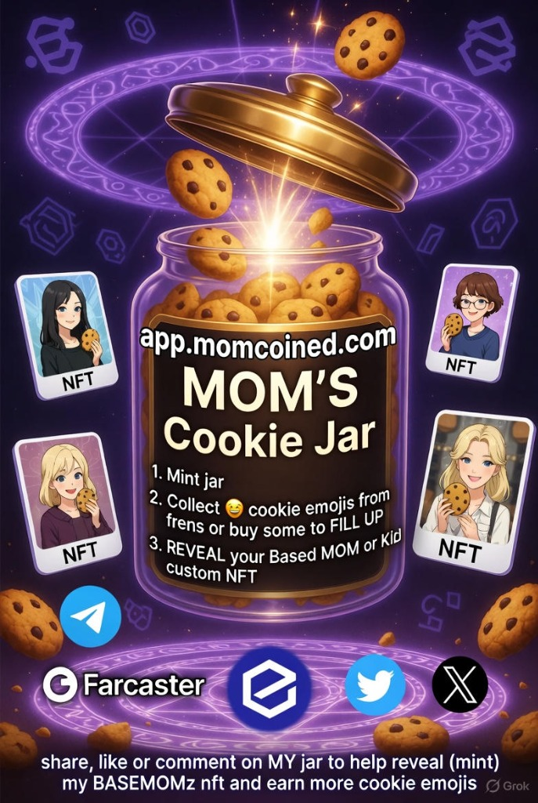
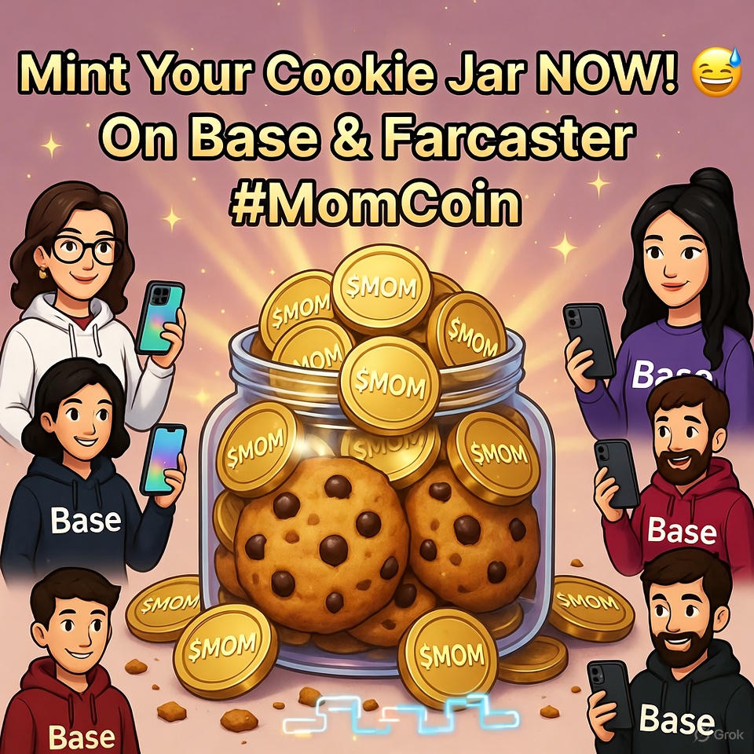

# MomCoin ($MOM) 🍪

**The First "Mom" on Base.**
Honoring the original Mom (Est. 1958).



## 🌟 What is MomCoin?

MomCoin is a social experiment and utility token on the Base L2 blockchain. It combines meme culture with real AI utility and gamified NFT mechanics.

### 🍪 The Cookie Jar (Live Now)
The **Mom's Cookie Jar** is our genesis NFT collection.
*   **Mint a Jar**: Get a sealed jar for ~$1 (ETH).
*   **Fill with Cookies**: Earn cookies by doing social tasks (or pay to fill instantly).
*   **Reveal Mom**: Once full, the jar opens to reveal your unique 3D Mom or Kid NFT.
*   **Dynamic Traits**: Your Mom evolves based on your on-chain activity.

### 🎥 Presale Video
[](public/presale.mp4)
> *Click to watch the video*

### 🤖 MomAI (Coming Soon)
Your personal AI Mom who:
*   Gives life advice (and cookie recipes).
*   Trades for you (Agentic DeFi).
*   Reminds you to call your real mom.

## 🛠️ Tech Stack

Built with the modern "Based" stack:
*   **Frontend**: Next.js 14 (App Router), TailwindCSS, Framer Motion
*   **Blockchain**: Base (Coinbase L2), Wagmi, Viem, OnchainKit
*   **Smart Wallet**: Passkey login (FaceID/TouchID)
*   **Identity**: Farcaster (Neynar API) & Firebase
*   **AI**: Google Gemini 2.0 Flash

## 🔗 Official Links

*   **Website**: [app.momcoined.com](https://app.momcoined.com)
*   **Twitter**: [@momcoin](https://twitter.com/momcoin)
*   **Warpcast**: [/momcoin](https://warpcast.com/momcoin)
*   **Contract**: [`0x2177...b07`](https://basescan.org/token/0x2177bCAC5c26507bfb4F0FF2cCbd255AE4BEDb07)

## 🚀 Running Locally

```bash
# 1. Clone the repo
git clone https://github.com/momcoinapp/momcoined.git

# 2. Install dependencies
npm install

# 3. Set up environment
# (See DEPLOYMENT_SECRETS_TEMPLATE.md in docs)

# 4. Run dev server
npm run dev
```

## 📜 License
MIT

